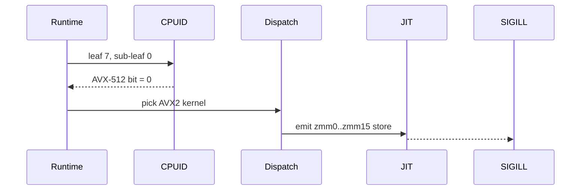

## Overview

| Attribute | Value |
| ----------- | ------- |
| **Date** | 2026-05-13 |
| **Objective** | Produce a long-form, episodic development blog post that reads as a self-contained story — root cause arrives near the end, every dead end is dignified with its own paragraph, primary-source quotes anchor the chapters, and Day numbering threads the post into a continuous series. |
| **Outcome** | A markdown-compliant `notes/blog/MM-DD-YYYY/README.md` with verified day number, mined verbatim quotes, milestone URLs, optional Mermaid diagrams, a Reproduce-It-Yourself section, and a References block. Verified by applying the methodology to PR #5402 (Day 187, 6,814 words). |

# Blog Writer Skill (v2)

Write episodic, story-arc development blog posts. v2 supersedes the v1.0.0 template (Plan → Challenges → Solutions → Learnings) which was structurally too thin for multi-day bug hunts and broke the narrative by leading with the answer.

## When to Use

- After a multi-day debugging or investigation arc closes (PR merged, issue resolved, milestone hit).
- When the journey itself is the interesting artifact, not just the technical answer.
- When prior posts in the series exist and continuity matters (`Day N` numbering, "Where We Left Off" callback).
- When you can mine primary-source quotes from Claude session logs to anchor specific chapters.

## When NOT to Use

- One-line bug fixes, mechanical refactors, or boilerplate generation — no story arc.
- Internal status updates that belong in a GitHub issue comment, not a blog post.
- Posts that need to lead with the answer (release announcements, security advisories) — use a different format.

## Methodology — Core Rules

### 1. Episodic Day Numbering

Every post in the series starts with `# Day [N spelled out]: [Subtitle]`. `N` is computed from the project's start date, **not** the very first commit. For ProjectOdyssey the anchor is 2025-11-07 (the "feat: complete 4-level hierarchical planning structure" commit). Always recompute from a known-good anchor post, never trust an existing post's number (the 03-16-2026 "Day 53" entry is anchor-inconsistent with the rest of the series).

```bash
# Compute day number from a known-good anchor.
python3 -c "
from datetime import date, timedelta
anchor_date = date(2026, 4, 20); anchor_day = 165
start = anchor_date - timedelta(days=anchor_day - 1)
target = date(2026, 5, 12)
print(f'start={start} day={(target - start).days + 1}')
"
# -> start=2025-11-07 day=187
```

### 2. Standard Frontmatter Block

After the H1 title, every post has the same structural opening:

```markdown
# Day One Hundred Eighty-Seven: The AVX-512 Phantom in the Hypervisor

[Optional in-medias-res cold-open paragraph — see Rule 3]

**Project:** ProjectOdyssey
**Date:** 2026-05-12
**Branch:** `5402-avx512-hypervisor-investigation`
**Tags:** #debugging #avx512 #hypervisor #compiler #mojo

---

> *Note: This post recounts a thirty-day investigation that began with a CI
> flake and ended with a four-line `/proc/cpuinfo` capture. The root cause
> is not at the top; you have to earn it.*
```

### 3. Story Arc — Root Cause Goes LAST

The cold-open should be **the moment of pivot** (the experiment or capture that broke the case open), not the answer. Then the post rewinds: "to understand why that mattered, you have to go back to April." The technical root cause arrives in chapter ~10 of ~14, near the end. Readers earn it.

### 4. TL;DR is a Journey Preview, Not the Answer

```markdown
## TL;DR

We chased six hypotheses across thirty days — an Intel SKU mismatch, a
microcode bug, a compiler frontend regression, a missing CPUID guard, a
hypervisor leak, a runtime dispatch defect — five of them wrong. The one
that survived contact with `/proc/cpuinfo` reframed the entire problem.
This post is the journey, not the answer.
```

The TL;DR **must not** contain the technical root cause. Every prior draft that included it killed the rest of the post.

### 5. Every Rejected Hypothesis Gets a Full Paragraph

Each dead end is a ~250–300 word chapter:

- What we believed at the start of the hypothesis
- What evidence we gathered
- The decisive observation that killed it
- How it reshaped the next hypothesis

Tenacity-and-determination tone. Don't apologize for the dead ends — they are the story.

### 6. Self-Contained Narrative

The post must be readable end-to-end without opening any external link. Verbatim probe outputs, register-file primers, CPU-feature explanations, and mechanism descriptions live in the post body. Outside links are reference material only — when the reader wants to verify, not when they need to understand.

Sweep test: comment out every link in the rendered post. Can you still follow the story? If not, the link is load-bearing and its content needs to be inlined.

### 7. Mine Claude Session Logs for Primary-Source Quotes

The Claude session jsonl logs at `~/.claude/projects/<encoded-project-path>/*.jsonl` hold the actual verbatim back-and-forth that drove the investigation. Mine them for 2–4 short verbatim quotes per post — one per chapter that pivoted on a specific exchange.

```bash
# List session logs for the project.
ls ~/.claude/projects/-home-mvillmow-Projects-ProjectOdyssey/*.jsonl

# Files are 2–7 MB each — DO NOT cat them. Filter first.
grep -l 'avx512\|AVX-512\|cpuid' ~/.claude/projects/-home-mvillmow-Projects-ProjectOdyssey/*.jsonl

# Extract just the matching user/assistant messages.
jq -r 'select(.message.content | type == "string") | select(.message.content | test("avx512"; "i")) | .message.content' \
  ~/.claude/projects/-home-mvillmow-Projects-ProjectOdyssey/<hash>.jsonl | head -100
```

Pick quotes that capture a pivot moment ("wait, what does `/proc/cpuinfo` say?") rather than generic banter.

### 8. Upstream Issue Comment URLs as Numbered Milestones

When the narrative reaches an upstream comment that records a milestone, cite it inline with the full URL:

```markdown
At this point I filed the eighth status update on the upstream issue
([modular/modular#6413, comment 3097412345](https://github.com/modular/modular/issues/6413#issuecomment-3097412345))
documenting the failed Skylake repro attempt.
```

The reader does not need to click — the chapter explains what happened — but the milestones make the upstream conversation traceable for someone who wants to verify or follow up.

### 9. Mermaid Diagrams Are Welcome

Prior posts used only ASCII tables. v2 adds Mermaid in fenced code blocks for data-flow, sequence, and decision visualizations:

````markdown

````

Use Mermaid for the Diagnostic Probe chapter especially.

### 10. "Reproduce It Yourself" Section

Near the end, include a fully self-contained command sequence — clone → checkout → build → run → observe — with no upstream-link dependencies. Someone reading the post on a phone offline must be able to copy-paste it later.

### 11. Precision of Claims

Use constructive phrasing for bug-scope claims: "any compiler driver that consumes CPUID leaf 7 without re-validating against XCR0 is exposed to this class of failure" — **not** "this has been broken on every Microsoft fleet runner since AMD EPYC entered Azure."

We have evidence for the code path; we do not have evidence for the deployment history. Resist sweeping editorial claims beyond direct evidence.

### 12. Token-Budget Transparency

If the investigation was expensive, include a short chapter acknowledging the model-token cost spent and what it bought. Not every post needs this; reserve for genuinely costly investigations.

### 13. Closing Pattern: Lessons Learned + References

The post closes with two sections in this order:

1. **Lessons Learned** — 3–7 bullets phrased as transferable rules, not "I learned X about this specific bug."
2. **References** — organized into subsections: (a) this issue's upstream thread, (b) related upstream issues, (c) external technical references, (d) PRs, (e) internal artifacts, (f) produced Mnemosyne skills, (g) prior posts in series.

## Chapter Outline (the pattern refined in Day 187)

1. Opening (in-medias-res optional)
2. Metadata + Note blockquote
3. TL;DR (journey, not answer)
4. Where We Left Off (continuity from prior post)
5. Building Infrastructure (PRs that enabled the investigation)
6. N Hypotheses, N Dead Ends (one full paragraph each, ~250–300 words)
7. The Investigation Pivot (chapter — what experiment broke the case)
8. Crime Scene Forensics (ISA / data / probe captures)
9. The Diagnostic Probe (Mermaid diagram welcome here)
10. The Smoking Gun in the Source (root cause arrives HERE, near end)
11. Token Budget — A Note on Cost (optional)
12. Reproduce It Yourself
13. Lessons Learned
14. References

## Verified Workflow

```bash
# 1. Determine the day number from a known-good anchor post.
python3 -c "
from datetime import date, timedelta
anchor_date = date(2026, 4, 20); anchor_day = 165
start = anchor_date - timedelta(days=anchor_day - 1)
target = date(YYYY, MM, DD)  # fill in target
print(f'start={start} day={(target - start).days + 1}')
"

# 2. Read the immediate prior post AND the longest prior post for style refs.
ls notes/blog/
wc -w notes/blog/*/README.md | sort -n

# 3. Mine Claude session logs.
ls ~/.claude/projects/-home-mvillmow-Projects-*/*.jsonl
grep -l 'KEYWORD' ~/.claude/projects/-home-mvillmow-Projects-*/*.jsonl
# Filter with jq, never cat the full file.

# 4. Draft notes/blog/MM-DD-YYYY/README.md following the chapter outline.
mkdir -p notes/blog/MM-DD-YYYY
$EDITOR notes/blog/MM-DD-YYYY/README.md

# 5. Verify markdown and word-count target.
pixi run npx markdownlint-cli2 notes/blog/MM-DD-YYYY/README.md
wc -w notes/blog/MM-DD-YYYY/README.md
# Target: >= longest recent post (Day 187 = 6,814).
# Floor: >= immediate prior post in series.

# 6. Open PR with auto-merge (squash) enabled.
gh pr create --title "blog: Day N — Subtitle" --body "..."
gh pr merge --auto --squash
```

## Failed Attempts

| Attempt | What Was Tried | Why It Failed | Lesson Learned |
| --- | --- | --- | --- |
| Generic topic-only title | "The Bug Hunt for AVX-512" with no day number | Posts felt disconnected from the series; reader had no continuity hook | Always lead with `Day N: Subtitle` to thread the series |
| Root cause at the top | Opening paragraph stated "the bug was a missing CPUID guard" | Killed the story arc; nothing left to earn | Move root cause to chapter ~10 of ~14, near the end |
| TL;DR that gives the answer | TL;DR summarized the technical fix in two sentences | Made every following chapter feel like filler | TL;DR is a journey preview: "we tried six theories, all wrong" |
| Sweeping editorial claims | "This has been broken on every Hyper-V Zen 4 GHA runner since AMD EPYC entered Microsoft's fleet" | Evidence supported the code path, not the deployment history | Reframe constructively: "any compiler that does X without Y is exposed" |
| Day numbering from gut feel | 03-16-2026 post labeled "Day Fifty-Three" but 2026-03-16 is ~130 days from the 2025-11-07 anchor | Inconsistent with rest of series | Always recompute from a known-good anchor post, never copy a number forward |
| Upstream comment links as load-bearing context | "See upstream comment 17 for the probe output" | Reader had to context-switch out of the post to follow the story | Inline the probe output verbatim; upstream links are reference, not exposition |
| v1.0.0 Plan→Challenges→Solutions→Learnings template | Generic four-section structure for a multi-day bug hunt | Too thin for episodic series; no place for dead-end chapters | Switch to the 14-chapter outline above |
| ASCII-only diagrams | Used pipe-and-dash tables for sequence flow | Hard to read for nontrivial data flow | Use Mermaid in fenced code blocks for sequence/flow visualizations |

## Results & Parameters

Posts produced or anchored by this methodology:

| Post | Date | Day | Words | Subtitle |
| --- | --- | --- | --- | --- |
| 03-16-2026 | 2026-03-16 | 53 (numbering err) | 3,830 | The UnsafePointer.bitcast Use-After-Free |
| 03-24-2026 | 2026-03-24 | 61 | 2,333 | The Slice View Bad-Free |
| 03-25-2026 | 2026-03-25 | 62 | 2,571 | Three Weeks of Firefighting |
| 04-20-2026 | 2026-04-20 | 165 | 2,223 | The 3.6 GB Virtual Ghost |
| 05-12-2026 | 2026-05-12 | 187 | 6,814 | The AVX-512 Phantom in the Hypervisor (PR #5402) |

Word-count guidance: target ≥ the immediate prior post; for capstone investigations target ≥ the longest prior (Day 187 at 6,814 is the current ceiling).

## Verified On

| Project | PR / Artifact | Date | Outcome |
| --- | --- | --- | --- |
| ProjectOdyssey | PR #5402 — `notes/blog/05-12-2026/README.md` (Day 187, 6,814 words) | 2026-05-12 | Markdownlint passed; auto-merge (squash) enabled; CI in flight at skill-write time |

Verification level: **verified-local**. Methodology applied end-to-end to one capstone post. Escalate to `verified-ci` once PR #5402 merges cleanly.

## Honesty Gate

- Workflow executed end-to-end for ProjectOdyssey PR #5402 (Day 187, 6,814 words).
- Markdownlint passed when invoked explicitly on the file. (`notes/blog/` is in `.markdownlint-cli2.jsonc` ignores per project convention, so CI does not lint it; the file was linted manually and passed.)
- Auto-merge enabled (squash).
- CI was pending at the time of this skill amendment; verification stays at `verified-local` until merge confirmation.
- The five reference posts in Results & Parameters are real and were read during the methodology refinement, but only the Day 187 post was written *by* this v2 methodology end-to-end; the earlier four were inputs that the methodology was distilled from.

## References

- Prior posts in series (style references): `notes/blog/03-16-2026/`, `03-24-2026/`, `03-25-2026/`, `04-20-2026/`, `05-12-2026/` in HomericIntelligence/ProjectOdyssey.
- Project markdown rules: `.markdownlint-cli2.jsonc` (note: `notes/blog/` is in the ignore list, but well-formedness is still expected).
- Day-numbering anchor: ProjectOdyssey commit "feat: complete 4-level hierarchical planning structure" on 2025-11-07.
- Related skill: `doc-validate-markdown` for markdown validation outside the blog tree.
- Superseded: v1.0.0 of this skill (template-only; see `.history` file for the v1 snapshot pointer).
