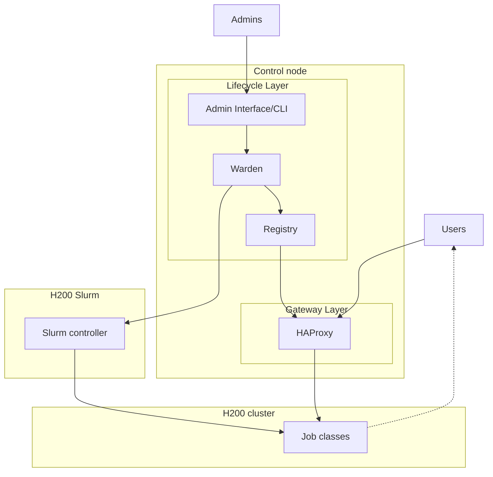

# Architecture Diagram Boundary Contracts

## Overview

| Field | Value |
|-------|-------|
| **Date** | 2026-06-22 |
| **Objective** | Capture how to revise an architecture design doc so component definitions, a Mermaid component diagram, and source-of-truth prose all express the same runtime ownership contract. |
| **Outcome** | Successful locally: the Inference360 design doc was revised to define components before the diagram, split user/admin paths, show Warden-to-scheduler lifecycle control, show HAProxy reading ready backend state from Registry, and remove misleading Registry-to-observability and fallback claims. |
| **Verification** | verified-local — CI validation pending. |

## When to Use

- A design doc has a component diagram but the components are not defined before the graph.
- A gateway, admin/control path, scheduler lifecycle path, registry, and runtime jobs are easy to conflate.
- A Mermaid graph implies the wrong source of truth, such as HAProxy reading manifests/templates directly instead of reading ready runtime state.
- A diagram shows runtime jobs inside a scheduler/controller box when the jobs actually run on a cluster managed by that controller.
- A design review asks to remove fallback language, implementation-only details, or class names that should stay conceptual.
- You need to validate doc-only architecture edits with repository doc tests and the full local test suite.

## Verified Workflow

Verified locally only — CI validation pending.

### Quick Reference

```bash
# Find stale or conflicting architecture terminology.
rg -n "fallback|Registry.*Prometheus|Prometheus.*Registry|production|experimental|reconciler" docs/inference360-design.md

# Check markdown whitespace and repository doc contracts.
git diff --check
pytest -q tests/test_governance_docs.py tests/test_agent_workflow_artifacts.py tests/test_observability_contracts.py

# Run the full suite before handing back the design-doc change.
pytest -q
```

### Detailed Steps

1. Define the vocabulary before the graph.
   Put a component-definition table before the component diagram. Each row should state what the component owns and, just as importantly, what it must not own.

2. Separate actors from interfaces.
   Use domain terms such as `Users` and `Admins` when those are the real actors. Users send inference traffic only. Admins authenticate to the admin interface or CLI for service-state mutation and status.

3. Split the control node into explicit paths.
   In the graph, put the user-facing gateway path in one subgraph and the authenticated admin/lifecycle path in another. Do not draw admin traffic through HAProxy unless HAProxy is actually the admin ingress.

4. Make the two-layer architecture visible in the graph.
   Show a `Gateway Layer` for HAProxy and a `Lifecycle Layer` for the admin interface, Registry, and lifecycle controller. The diagram should express the architectural decision without requiring the reader to infer it from prose.

5. Draw source-of-truth handoffs, not implementation wishes.
   Desired-state inputs such as manifests and templates should feed the lifecycle controller when that controller renders or applies them. Runtime routing inputs should feed the gateway from the Registry. If HAProxy consumes ready backend state from Registry, draw `Registry -> HAProxy`, not `Manifest -> HAProxy`.

6. Keep scheduler control distinct from running jobs.
   If a scheduler controller manages jobs, put the controller between the lifecycle component and the jobs. Keep job classes in a separate cluster/data-plane area, not inside the scheduler/controller box.

7. Use directional and visual semantics consistently.
   Color lifecycle/admin edges separately from gateway/user edges. Use dotted arrows for result/response paths when the request path is already shown. Recalculate Mermaid `linkStyle` indices after every edge insertion or deletion.

8. Remove misleading direct observability edges.
   If the Registry does not connect to Prometheus or Grafana, remove `Registry -> Prometheus/Grafana` edges and prose. Observability should come from jobs, HAProxy, and exporters unless the implementation truly scrapes Registry.

9. Prefer conceptual names in the design doc.
   Use names like `job classes` instead of concrete current class names when the design is meant to support multiple classes. Keep concrete CLI/function names only in sections explicitly documenting current implementation.

10. Validate the wording and the contract.
    Run a grep sweep for removed terms, `git diff --check`, targeted doc tests, and the full test suite. Report local verification honestly as `verified-local` unless CI was observed.

## Failed Attempts

| Attempt | What Was Tried | Why It Failed | Lesson Learned |
|---------|----------------|---------------|----------------|
| Diagram before definitions | Started with a component diagram while component meanings were not established | Reviewers could not tell what each box owned or which terms were authoritative | Put component definitions before the graph and include ownership boundaries |
| Gateway reading manifests/templates | Drew or implied direct `manifest/template -> HAProxy` inputs | It contradicted the runtime contract: HAProxy selects ready backends from Registry state | Draw desired state into the lifecycle layer and runtime-ready state from Registry into HAProxy |
| Registry connected to observability | Included `Registry -> Prometheus` and prose saying Prometheus consumed registry shape | The Registry does not connect to Prometheus or Grafana in the design | Metrics should flow from jobs, HAProxy, and exporters unless Registry scraping is explicitly implemented |
| Scheduler box contained jobs | Placed job classes inside the Slurm/controller box | It implied jobs live inside the scheduler control plane instead of on the H200 cluster | Put the scheduler controller between Warden and job classes; put job classes in the cluster/data-plane area |
| Concrete class names in design language | Used specific production/experimental wording throughout a design intended for multiple classes | It prematurely narrowed the design and mixed current implementation detail into architecture | Use `job classes` in design sections; reserve concrete names for current CLI/schema references |
| Mermaid edge colors drifted | Added/removing edges without updating `linkStyle` indices | Edge colors no longer matched lifecycle vs gateway semantics | Group edge declarations by role and reindex `linkStyle` after edits |

## Results & Parameters

### Diagram Contract Pattern



### Ownership Rules

| Component | Owns | Must not own |
|-----------|------|--------------|
| Users | OpenAI-compatible inference requests | Privileged service-state mutation |
| Admin interface | Authenticated service-state mutation and status | User inference proxying |
| Warden | Lifecycle commands, scheduler interaction, Registry updates | User inference proxying |
| Registry | Runtime readiness and observed state | Manifest source-of-truth authority, Prometheus/Grafana connection |
| HAProxy | User-facing request selection among ready backends | Scheduler mutation, manifest validation |
| Scheduler controller | Job lifecycle management | Route policy or user traffic |
| Job classes | Model serving and results | Admin state mutation |

### Validation Results From Inference360 Session

```text
git diff --check
pytest -q tests/test_governance_docs.py tests/test_agent_workflow_artifacts.py tests/test_observability_contracts.py
# 18 passed

pytest -q
# 772 passed, 1 skipped
```

## Verified On

| Project | Context | Details |
|---------|---------|---------|
| Inference360 | Overarching design doc architecture cleanup | Updated `docs/inference360-design.md` component definitions and Mermaid diagram; verified locally with `git diff --check`, targeted docs tests, and full pytest. |
